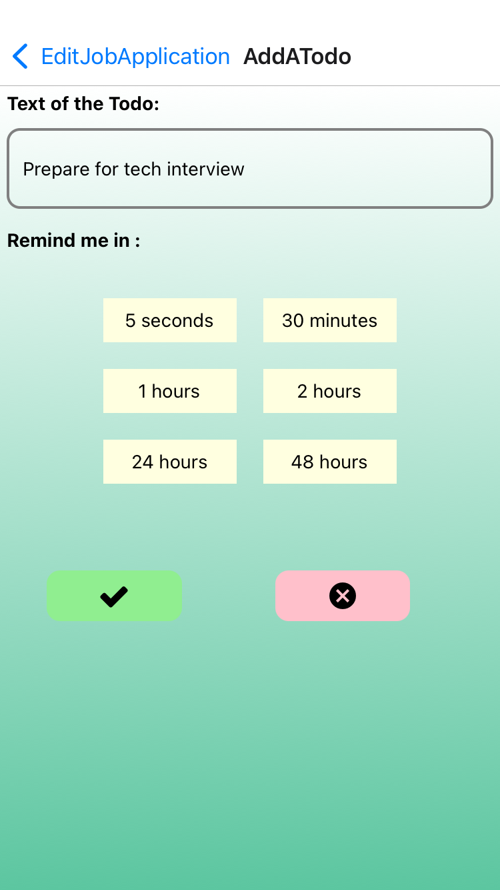

## Project Name: Husky Job Application Tracker

Tired of losing track of your job applications? Meet HuskyJobApplicationTracker, your personal job hunting assistant.

As a fellow computer science student, I know firsthand the stress and chaos of the job search. That's why I built HuskyApplicationTracker. With our app, you can:

* Organize your applications in one place.
* Assign a preference score for each job.
* Keep track of notes and to-dos for each job.
* Analyze your progress and identify trends.

Let's simplify your job search and land that dream job together!

### Video demo of the Minimal Viable Product
[](https://www.youtube.com/watch?v=gCP4KvoNVYw)

### Screenshots
| Image                                                              | Title      |
|--------------------------------------------------------------------|-----------|
| | the job application records page   | 
| | the personal achievement page  | 
|  | detail of the job application record  | 
|  | the notes section    | 
|  |  add a note   | 
|  |  the todo items section   | 
|  |  add a todo   | 
|  |  set a notification   | 

### Features
- Authentication
  - Sign up
  - Log in
  - Password Reset
- Browse all Job Application Records
  - sort the records by last update or by preference score
  - filter the records by the company's name or the position
- Job Records
    - Add a job record
    - Edit a job record
    - Delete a job record
- Add/Delete a note to one job record
    - take a photo as the note
- Add/Delete a todo item to one job record
    - set up a reminder for this todo item
    - toggle the status of the todo item
- Achievement Page
    - See data analysis of one's job applications

### Tech Stack
- Language: JavaScript
- Front End: React Native
- Backend and Database: Google Firebase

### How to use this repo
- navigate to the folder of your choice and clone this repo
```
 cd newFolder 
 git clone https://github.com/cathyfu1215/huksyApplicationTracker.git

```
- navigate to the folder of this project and install all the dependencies
```
cd huksyApplicationTracker
npm install
```
- use expo to open the project
```
npx expo start
```

- depends on android or iphone you are using:
  - if you have iphone, please scan the QR code using your camera
  - if you have android phone, please install Expo Go and scan the QR code using this app

- voila!
- Please provide feedback / bug reports to Cathy(fu.con@northeastern.edu) and she will appreciate this :D

### Data Model

Collections and subcollections:

* users (contains document 'user')
* jobApplicationRecords (contains document 'jobApplicationRecord')
* notes (contains document 'note')
* todos (contains document 'todo')

Documents:

* user
* jobApplicationRecord
* note
* todo

The organization of the collections and documents:

* The top level of our collection is the users collection.
* Each user in users collection will have a document, which contains several properties, including the subcollection of jobApplicationRecords.
* Each jobApplicationRecord document will contain several properties, including the subcollection of notes and todos.
* Please see details of the documents below.

##### (Document)User
- email (String)
- name (String)
- profilePhoto (blob)
- numJobsSaved (int)
- numJobsApplied (int)
- numInterview (int)
- numOffer (int)
- numRejection (int)
- jobApplicationRecords (collection)

##### (Document)JobApplicationRecord
- company (String)
- postion (String)
- location (String/location object)
- preferenceScore (int, [1,10])
- URL (String,optional)
- status (Enum):
    - In Progress
    - Applied
    - Interviewing
    - Interviewed
    - Offer
    - Offer Accepted
    - Rejected
- notes (Collection,optional)
- todos (Collection,optional)
- lastUpdated (datetime)

##### (Document) Note
- photo (blob)
- text (String)
##### (Document) Todo
- text (String)
- completed (boolean)

### Credits

This project originates from a [Mobile Development class project](https://github.com/cathyfu1215/huskyJobHuntTracker), which is designed by me, and implemented by me and my teammate Serena. We received help and advices from my professor Neda, teaching assistant Min and lots of classmates.


I am willing to improve this product after the class ends, so I started this new repo.
I will fix the existing bugs, improve the UX design and add more features to this product.
I hope it will help more students in the job hunt season!


### What's new in this version:
- Improved readability of the code base, adding more comment
- Added more layers of security: 
    - hide/display sign up/login page password input
    - adjusted firebase rules
- Added logic to update user's achievement
- Removed three non-essential components for now
    - News in single job application record
    - Location Use in single job application record
    - Collectibles in Achievement page
- Adjusted the content of a todo item, added the checkbox icon
- Refactored the code for notification so it is reusable
- Improved UI design :
    - navigation
    - theme color
    - button text
    - added user-friendly error message


